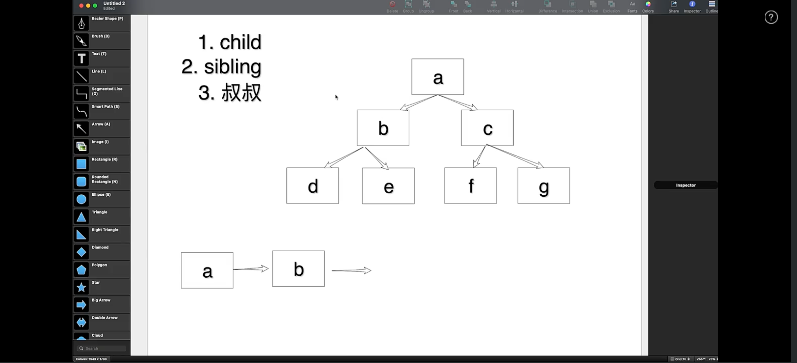
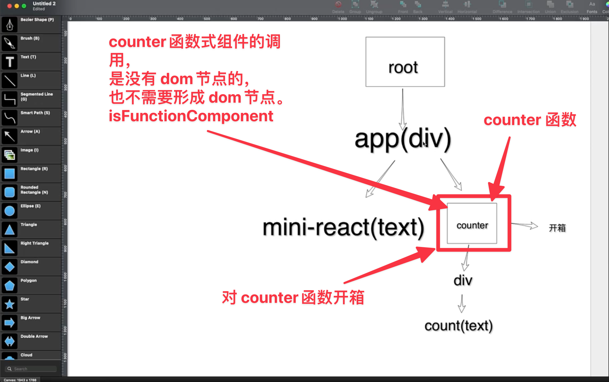
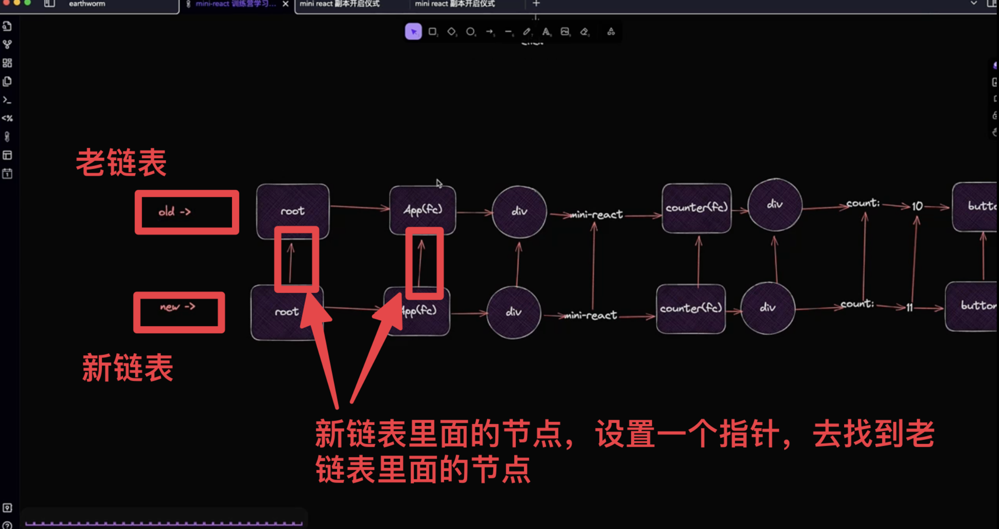
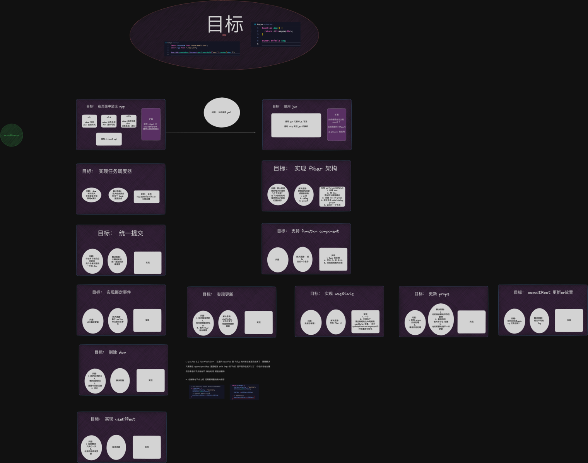

# mini-react

最近一周的时候，跟着崔哥尝试写了 mini-react。

从实现静态数据的《最简 mini-react》开始，到利用 vite 使用《JSX 语法》。

在 DOM 初始化阶段，实现了《任务调度器》，实现了《fiber 架构》，实现了《DOM 统一提交》，最后在初始化阶段还实现了《Function Component 初始化函数式组件》。

在 DOM 的更新阶段，实现了《绑定事件》，实现了《更新 props》,在 DOM 更新 children 的过程中，分别实现了《diff 实现 children 的更新--type 不一致 删除旧的，创建新的》和《diff 实现 children 的更新--新的比老的短，多出来的节点需要删除掉》，最后优化了 DOM 树的渲染《优化更新 减少不必要的计算》，只更新数据被修改的 DOM 子树,而不是整个 root 树。

## 通过画图配合理解 fiber 架构：DOM 初始化阶段 和 DOM 更新阶段

在 DOM 初始化阶段，一个很重要的点就是把树结构转变成链表结构。转变成链表的总体规则如下：优先找 child 孩子节点，没有孩子节点就找 sibling 兄弟节点，没有孩子节点和兄弟节点，就找 uncle 叔叔节点。根据以上规则，再配合图表，就能深刻理解树转链表的内容了。

在 DOM 初始化阶段，还有一个重要的点就是 Function Components 的初始化。也就是如何做函数式组件的开箱操作：

在 DOM 更新阶段，画图理解更新 props 和 更新 children 的过程，就显得更加重要了。生成新老链表，并且新链表中的节点指针指向老链表。如图所示:

通过画图的方式理清代码的逻辑关系，这一点让我很受启发。

## 在学习 mini-react 的过程中，加深了对重构中小步走思想的理解

在实现 mini-react 的过程中，最开始实现的是最简陋的纯静态数据的版本，然后一步步的增加新的功能，而不是一上来就要搞把大的。

在新增功能的过程中，也是小步走，在写完一个小功能的时候，就启动`重构->编译->测试`循环,保证重构的质量。哪怕是测试的时候，最开始也没有使用单元测试等自动化测试，而是手工去测试，这里也体现了小步走的思想。

## 辛苦但是值得

短时间内密集的输入和输出，肯定会辛苦一些。但是高密度的输入输出，才是真学习，而不是假学习。
这种方式能有效的避免`Tutorial Hell(教程地狱)`，就是买了很多课，却不去花费大量的时间去学习、练习、应用、创造，除了给自己虚幻的自我满足，没有真正的用处。

PS: github 代码仓库链接：https://github.com/shuimu0579/mini-react

<https://excalidraw.com/>
